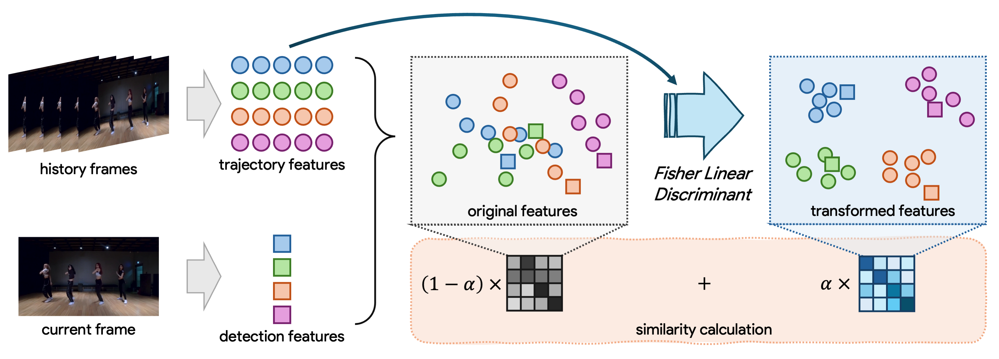

# 🎩 History-Aware Transformation of ReID Features for Multiple Object Tracking

This is the official PyTorch implementation of our paper:

> ***[History-Aware Transformation of ReID Features for Multiple Object Tracking](https://arxiv.org/abs/2503.12562)*** <br>
> :mortar_board: [Ruopeng Gao](https://ruopenggao.com/), Yuyao Wang, [Chunxu Liu](https://lcxrocks.github.io/), [Limin Wang](https://wanglimin.github.io/) <br>
> :e-mail: Primary contact: ruopenggao@gmail.com

## :mag: Overview

**TL; DR.** We propose a plug-and-play **H**istory-**A**ware **T**ransformation algorithm for appearance features (*i.e.*, ReID features). **Guided by historical information, we seek a more discriminative subspace for target features** in video sequences, enabling **better differentiation between different trajectories**. Our method significantly enhances the reliability of appearance features, improving the performance of ReID-based MOT trackers.



## :pencil2: Citation

If you think this project is helpful, please feel free to leave a :star: and cite our paper:

```tex
@article{{HATReID-MOT},
  title={History-aware transformation of reid features for multiple object tracking},
  author={Gao, Ruopeng and Wang, Yuyao and Liu, Chunxu and Wang, Limin},
  journal={arXiv preprint arXiv:2503.12562},
  year={2025}
}
```